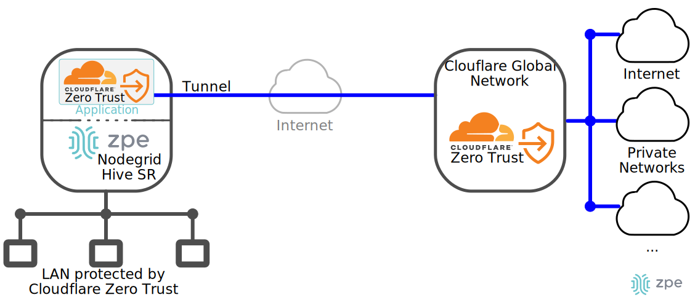
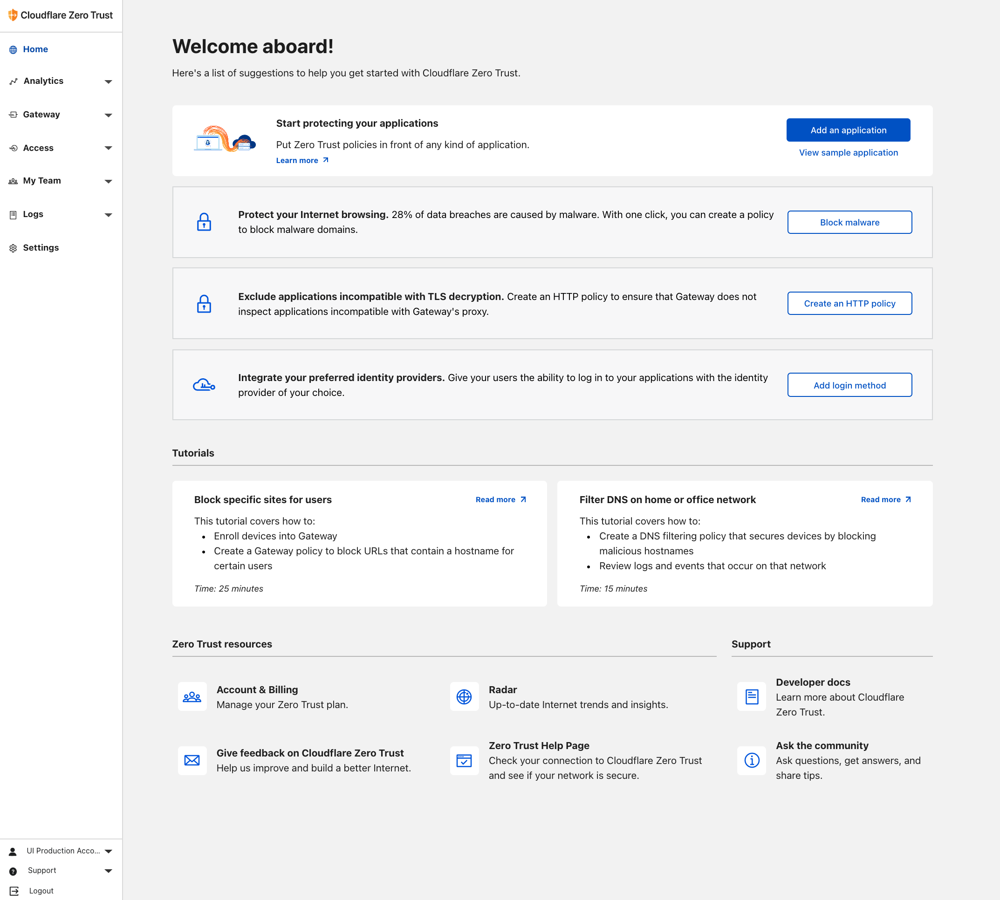
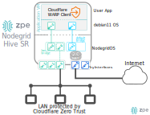
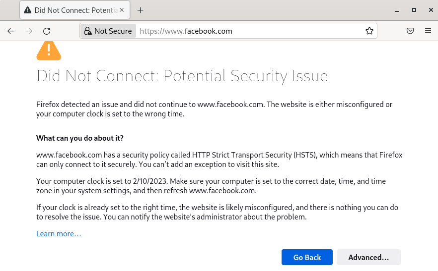

# ZPE - Cloudflare Zero Trust Usecase

ZPE as a Platform enables the deployment of third-party services/applications such as [Cloudflare Zero Trust](https://www.cloudflare.com/products/zero-trust/) (the **Usecase**). This guide describes the main steps to deploy Cloudflare Zero Trust in a *ZPE Nodegrid Hive SR* as depicted in the following diagram.
>*Cloudflare Zero Trust replaces legacy security perimeters with a global edge, making the Internet faster and safer for teams around the world ...*. 



The usecase's objective is to enable Internet traffic protection from and to a LAN deployed in a ZPE Nodegride Hive SR by Cloudflare Zero Trust. 

This guide structure is as follows:
1. Cloudflare Zero Trust environment configuration
2. ZPE as a platform: Deploying a third-party application/service
3. Validation of the scenario

## 1. Cloudflare Zero Trust environment configuration
The following guidelines are based on [Cloudflare Zero Trust Docs](https://developers.cloudflare.com/cloudflare-one/setup/).

### Prerequisites
- A Cloudflare account

### Start from the Cloudflare dashboard

1. On your Account Home in the [Cloudflare dashboard](https://dash.cloudflare.com/), click on the *Zero Trust* icon.
2. On the onboarding screen, choose a [team name](https://developers.cloudflare.com/cloudflare-one/glossary/#team-name).
3. Complete your onboarding by selecting a subscription plan and entering your payment details. If you chose the *Zero Trust Free plan*, please note this step is still needed, but you will not be charged.
4. Welcome to the Zero Trust dashboard! Your account has been created. You can now explore a list of one-click actions we have designed to help you kickstart your experience with Cloudflare Zero Trust.


### Identity: [Service tokens](https://developers.cloudflare.com/cloudflare-one/identity/service-tokens/)
Cloudflare Zero Trust provides service tokens to authenticate against Zero Trust policies. *Cloudflare Access* generates service tokens that consist of a *Client ID* and a *Client Secret*. Automated systems or applications can then use these values to reach an application protected by Access.

#### Create a service token
1. In the [Zero Trust dashboard](https://dash.teams.cloudflare.com/), navigate to **Access > Service Auth > Service Tokens**.
2. Select **Create Service Token**.
3. Name the service token. The name allows you to easily identify events related to the token in the logs and to revoke the token individually.
4. Choose a **Service Token Duration**. This sets the expiration date for the token.
5. Select **Generate token**. You will see the generated *Client ID* and *Client Secret* for the service token, as well as their respective request headers.
6. Copy the *Client Secret*.

> **Important**: This is the **only time** Cloudflare Access will display the *Client Secret*. If you lose the *Client Secret*, you must generate a new service token.

Next, the service token shall be used to configure the Access policies and device enrollment rules.

### Set device enrollment permissions
To specify which users in your organization can enroll new devices:

1. In the [Zero Trust dashboard](https://dash.teams.cloudflare.com/), go to **Settings > WARP Client**.
2. In the **Device enrollment** card, select **Manage**.
3. In the **Rules** tab, select **Add a rule**
4. Name the rule, and in **Rule action** select *Service Auth*.
5. In the Include subsection: **Selector** > *Service Token*, and **Value** > choose the service token previously created.
6. Select **Save**

Your device enrollment rules are now active. To see which devices have been enrolled or revoked, go to **My Team > Devices**.

### Gateway Policies
Cloudflare Secure Web Gateway allows you to set up policies to inspect DNS, Network, and HTTP traffic.

- **DNS policies** inspect DNS queries. You can block domains and IP addresses from resolving on your devices. 
- **Network policies** inspect individual TCP/UDP/GRE packets. You can block access to specific ports on your origin server, including non-HTTP resources.
- **HTTP policies** inspect HTTP requests. You can block specific URLs from loading, not just the domain itself. 

This guideline only considers the definition of a DNS policy, which shall be used to validate the functionality, i.e., blocking a specific domain access from the LAN.

#### DNS policies
When a user makes a DNS request to Gateway, Gateway matches the request against the content or security categories you have set up for your organization. If the domain does not belong to any blocked categories, or if it matches an Override policy, the user’s client receives the DNS resolution and initiates an HTTP connection.

A DNS policy consists of an Action as well as a logical expression that determines the scope of the action. To build an expression, you need to choose a Selector and an Operator, and enter a value or range of values in the Value field. In this example, the policy will block any domain that ends with `domain.com`.

1. In the [Zero Trust dashboard](https://dash.teams.cloudflare.com/), go to **Gateway > Firewall Policies**.
2. In the **DNS** card, select **Create a policy**
3. **Name your policy** section: name the policy and insert a brief description (latter optional)
4. **Build an expression** section: **Selector** > *Domain*, **Operator** > *matches regex*, **Value** insert `^*.domain.com` 
5. **Select an action** section: **Action** > *Block*
6. Select **Save policy**

### Set up Split Tunnels
Define a LAN network to be excluded from WARP.

1. In the [Zero Trust dashboard](https://dash.teams.cloudflare.com/), go to **Settings > WARP Client.**
2. Under **Device settings**, locate the *default* device profile and select **Configure.**
3. Under **Split Tunnels**, choose a Split Tunnel mode:
    - **(default) Exclude IPs and domains** — All traffic will be sent to Cloudflare Gateway except for the IPs and domains you specify.
4. Select **Manage**
5. In the **Selector dropdown**, select *IP Address*.
6. Enter the IP address or CIDR, e.g., *192.168.99.0/24*
7. Enter an optional description and then select **Save destination.**

The *IP address* will appear in the list of Split Tunnel entries. Traffic to these IP addresses will be excluded from WARP.

### Deploy the WARP client in ZPE
The following section describes how to deploy the WARP client in ZPE as an Application, and how to configure the LAN.

## 2. ZPE as a platform: Deploying a third-party application/service
This section describes how to deploy a third-party application/service in a ZPE Nodegrid, specifically the Cloudflare WARP application, and how to configure Cloudflare Zero Trust to protect and policy a LAN traffic. The process is twofold: a) steps to deploy an application in a Nodegrid Hive SR, and b) Cloudflare WARP installation and configuration. 

The application will be deployed in a Virtual Machine (VM) hosted by a Nodegride Hive SR as depicted by the following diagram:



### ZPE Requirements
This guideline is based on the following Nodegrid Hive SR:
|             |                                       |
|-------------|---------------------------------------|
| Version     | v5.4.4 (Jan 29 2022 - 15:54:02)       |
| CPU         | Intel(R) Atom(TM) CPU C3558 @ 2.20GHz |
| CPU Cores   | 4                                     |
| RAM         | 15GB                                  |
| Disk        | 9GB                                   |
| ZPE License | 5 VMs                                 |

### Virtual Machine deployment
The requirements for the VM are:
- 1 GB RAM
- 1 vCPU
- 7 GB disk
- 2 virtual network interfaces 
  - LAN access (*virt0 -> eth0*)
  - WAN access (*virt1 -> eth1*)

#### Network configuration
Access to the Nodegride Hive SR web interface > **Network > Connections**. To create the **LAN bridge**: 
1. Select **Add**
2. Name the bridge *brlan*, **Type** > *Bridge*
3. Select **IPv4 Mode** > *No IPv4 Address*
4. **Bridge Interfaces** > *lan0*
5. Select **Save**

Access to the Nodegride Hive SR web interface > **Applications > Virtual Machines > Networks**
1. Select *default* network and **activate** it

### VM instantiation
Access to the Nodegride Hive SR web interface > **Applications > Virtual Machines**

1. Select **Create VM**, and fill the *Create new virtual machine* form with:

| Field               | Value                                 |
|---------------------|---------------------------------------|
| Name                | cloudflare                            |
| Installation type   | URL (ISO image or distro install tree)|
| Installation source | [http://ftp.us.debian.org/debian/dists/Debian11.6/main/installer-amd64/](http://ftp.us.debian.org/debian/dists/Debian11.6/main/installer-amd64/)|
| Operating system    | Debian                                |
| Storage             | Create new volume                     |
| Size                | 7GiB                                  |
| Memory              | 1GiB                                  |
2. Select **Create**
3. Access to the **cloudflare** VNC console,and complete the Debian OS installation process in the VM considering the following:
- Headless VM (no desktop environment)
- Root credentials 
4. Add a new network interface to the **cloudflare** VM considering:

|Field|Value|
|--|--|
|Interface type| Bridge to LAN|
|Source| bridge name, e.g., *br0*|
|Model| (Linux, perf) |
|Persistence| check *Always attach* |

5. Cloudflare WARP application installation and configuration in the next section.

### ZPE application: Cloudflare WARP 
Access to the Nodegride Hive SR web interface > **Applications > Virtual machines > cloudflare** VNC console

1. Access to the terminal
2. Install the following packages: `git`, `python3-pip`
```bash
su
apt install git python3-pip sudo
```
3. Install `ansible`
```bash
su
python3 -m pip install --user ansible
export PATH="$PATH:$HOME/.local/bin"
```
4. Clone the following repo:
```bash
git clone zpe-cloudflarewarp
cd zpe-cloudflarewarp
```
5. Edit the `vars/vars.yml` file filling the required information in the `<<field>>` fields
```yaml
# Cloudflare WARP Service token
cloudflare_organization: <<organization name>>
cloudflare_auth_client_id: <<auth_client_id>>
cloudflare_auth_client_secret: <<auth_client_secret>>
  
# VM LAN interface
lan_interface: <<lan_interface_name>>

# Cloudflare LAN
# Split Tunnel LAN network enabled in cloudflare, e.g., 192.168.99.0/24
cloudflare_network: 192.168.99.0/24
cloudflare_address_a: 192.168.99.1/24
cloudflare_address_b: 192.168.99.2/24
cloudflare_gateway: 192.168.99.1
```

6. Execute the ansible playbook to install the cloudflare WARP client
```bash
su
cd zpe-cloudflarewarp
ansible-playbook cloudflarewarp.yml -K
```
7. Connect a Client into the hive SR `lan0` port
8. Validate the scenario

## 3. Validation of the scenario
The validation consists of:
1. Define a firewall rule that blocks the following reg-exp domain in the [Cloudflare Zero Trust dashboard](https://dash.teams.cloudflare.com/)
    - Reg-exp: `^*.facebook.com`
2. Access from a LAN Client to the URL `facebook.com` 
3. The Client should not be able to access the webpage



